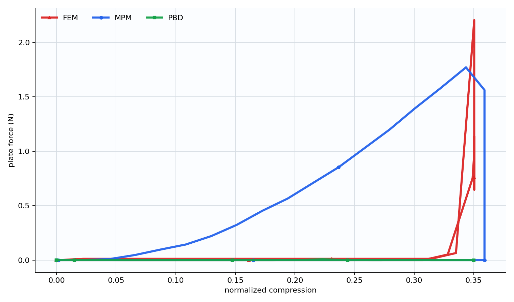
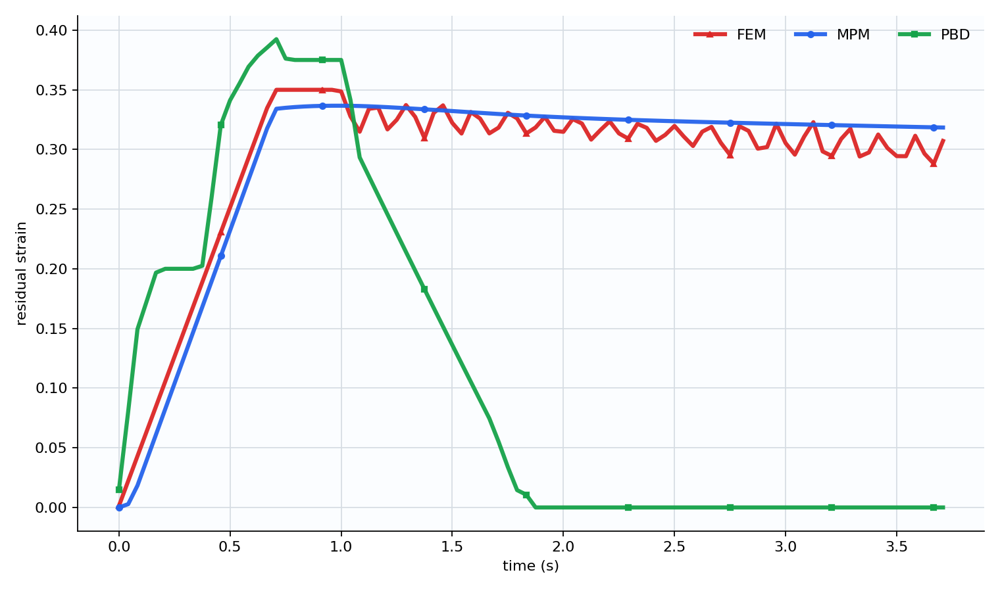
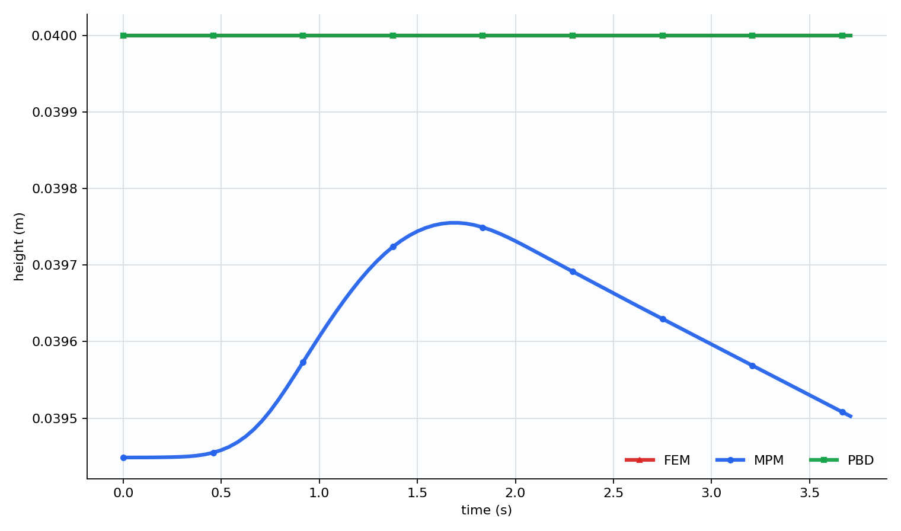
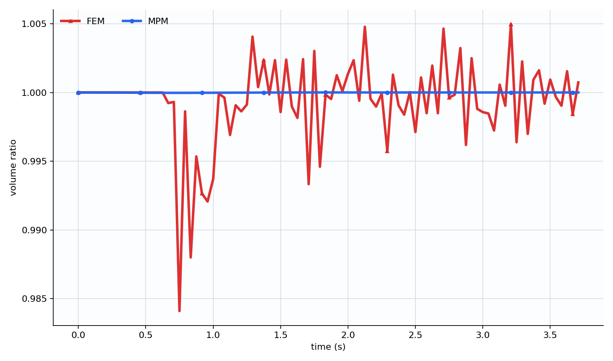

# 3D 软体夹板压缩仿真对比报告

## 1. 实验目标

本项目的主线实验聚焦 3D 软体球在两个刚性夹板之间被压缩、保持、释放并回弹的过程。对比对象为三种软体模拟方法：

- MPM（Material Point Method，物质点法）
- PBD（Position Based Dynamics，基于位置的动力学）
- FEM（Finite Element Method，有限元法）

实验希望回答的问题不是单纯“哪一个画面最好看”，而是比较三种方法在相同 3D 场景下的力学响应、回弹行为、体积保持、接触稳定性和计算性能。

本报告只分析球形软体的三种方法。盒体实验仍保留在代码和输出中，但球形几何更简单，三条曲线更容易直接比较。

## 2. 三种方法的基本原理

### 2.1 MPM：粒子和背景网格混合

MPM 把软体材料表示成一批携带质量、速度、形变梯度和材料状态的粒子。每个时间步中，粒子先把质量和动量转移到背景网格，网格上计算力、速度更新和边界接触，再把速度和形变信息从网格传回粒子。

在本项目中，MPM 的核心过程是：

1. 粒子到网格（P2G）：把粒子质量、动量、弹性应力传到网格。
2. 网格更新：加入阻尼、边界、刚性夹板速度约束。
3. 网格到粒子（G2P）：把网格速度传回粒子，更新粒子位置和形变梯度。
4. 根据形变梯度估计体积变化和弹性能。

MPM 的特点是适合大变形和连续材料流动，接触处理相对自然，但数值耗散和回弹行为会受到网格分辨率、时间步、材料模型和接触投影方式影响。

### 2.2 PBD：直接修正位置满足约束

PBD 不直接从应力方程出发，而是先预测粒子位置，再通过约束投影把粒子位置修正到满足距离约束、碰撞约束等条件。

在本项目中，PBD 软体由 3D 点阵和距离约束组成：

1. 点阵粒子按速度预测新位置。
2. 相邻点之间的距离约束被反复投影，使结构尽量保持原始形状。
3. 如果点进入夹板体积，则投影回夹板内侧。
4. 用修正后的位置反推速度。

PBD 的特点是稳定、容易控制形状恢复，适合实时和视觉效果。但它的约束刚度不是严格的杨氏模量，接触力也不是天然的物理反力。本项目中的 PBD `plate_force_n` 只是位置投影修正量估计值，因此不能和 MPM/FEM 的反力严格等价比较。

### 2.3 FEM：四面体单元上的连续介质力学

FEM 把软体离散成四面体网格。每个四面体单元根据当前形变和初始形状计算形变梯度，再由材料模型得到应力和节点力。

在本项目中，FEM 的核心过程是：

1. 生成低分辨率四面体网格。
2. 每个四面体计算形变梯度 `F`。
3. 使用 corotated 弹性模型计算弹性力。
4. 用显式时间积分更新节点速度和位置。
5. 对刚性夹板进行碰撞投影。

FEM 的优点是物理含义清楚，材料参数更可解释；缺点是四面体网格生成、接触处理和显式稳定性都更敏感。本项目 FEM 为低分辨率原型，因此视觉点较稀疏，但力学响应仍能体现有限元方法的特点。

## 3. 控制变量与近似相等变量

为了让三种方法可比较，实验尽量统一以下变量。

| 类别 | 统一设置 | 说明 |
|---|---:|---|
| 几何体 | 直径约 40 mm 的球体 | 三种方法使用同一目标尺寸 |
| 仿真域 | 0.10 m 立方域 | 便于统一相机和边界 |
| 软体中心 | `[0.05, 0.05, 0.05]` m | 初始位置一致 |
| 密度 | `1000 kg/m^3` | 接近软胶/水的量级 |
| 杨氏模量 | `30000 Pa` | MPM/FEM 直接使用；PBD 只能近似对应 |
| 泊松比 | `0.35` | MPM/FEM 直接使用；PBD 不直接使用 |
| 夹板厚度 | `0.006 m` | 三者一致 |
| 夹板高度/深度 | `0.075 m` | 三者一致 |
| 初始夹板间距 | 物体直径的 `1.05` 倍 | 三者一致 |
| 最大压缩间距 | 物体直径的 `0.70` 倍 | 三者一致 |
| 压缩时间 | `0.70 s` | 三者一致 |
| 保持时间 | `0.30 s` | 三者一致 |
| 释放时间 | `0.70 s` | 三者一致 |
| 释放后等待 | 约 `2.00 s` | 方便比较回弹 |

但仍有一些变量只能近似对齐，不能完全相等：

- 离散方式不同：MPM 使用材料点和背景网格，PBD 使用点阵约束，FEM 使用四面体网格。
- 刚度含义不同：MPM/FEM 的 `E` 和 `nu` 进入应力模型；PBD 的 `constraint_stiffness` 是约束投影参数，不等于杨氏模量。
- 力的定义不同：MPM/FEM 的反力来自接触约束和材料响应；PBD 的反力是位置投影修正量估计，因此明显偏小。
- 时间步不同：三种方法为了稳定性使用不同 `dt`、substep 和迭代次数。
- 分辨率不同：FEM 网格较稀疏，PBD 点阵和 MPM 粒子数也不完全一致。

因此，本实验中“夹板参数、几何尺寸、材料目标、运动过程”尽量一致；“内部数值求解参数”根据各方法稳定性分别设置。

## 4. 关键图表

### 4.1 力-位移曲线

从力-位移曲线看，MPM 和 FEM 都能形成明显的夹板反力。MPM 的反力随压缩量逐渐上升，峰值约 `1.77 N`；FEM 峰值约 `2.20 N`，但主要集中在最大压缩附近，曲线更尖。

PBD 曲线几乎贴近 0，并不代表软体没有被压缩，而是因为当前 PBD 的力并非严格物理反力。PBD 主要通过位置约束修正形状，内部约束做了大量“隐式修正”，这些修正没有完整转化成夹板反力。因此 PBD 更适合比较形状恢复，不适合直接比较接触力大小。

### 4.2 回弹残余形变

回弹曲线是本次最直观的结果。

PBD 在释放后迅速回到接近 0 的残余形变，说明位置约束非常擅长把形状拉回原始状态。它的回弹效果最好看，但物理解释性较弱。

MPM 在释放后仍保留约 `0.318` 的最终残余形变，说明当前 MPM 参数和接触投影下回弹不足，材料更像被压扁后有明显数值耗散或塑性残留。严格说，我们当前 MPM 使用的是弹性模型，但粒子投影式接触和网格耗散会让恢复不完全。

FEM 最终残余形变约 `0.307`，和 MPM 接近，但曲线有振荡。这体现了显式 FEM 的特点：弹性响应更直接，但低分辨率网格和显式积分会带来振动。

### 4.3 高度变化

高度曲线反映横向压缩时软体是否向其他方向鼓出。MPM 和 FEM 都出现了一定横向变形后的高度变化，PBD 因为距离约束强烈维持原始结构，整体形状恢复更快。

### 4.4 体积保持

MPM 的体积比几乎维持在 `1.0` 附近，说明在当前参数下体积保持非常好。FEM 的体积比范围约为 `0.984` 到 `1.005`，仍然在合理范围内，但比 MPM 波动更明显。PBD 当前没有严格体积计算，因此图中不显示 PBD 的体积比曲线。

## 5. 数据摘要

| 方法 | 峰值反力 N | 最大穿透 m | 释放结束残余形变 | 最终残余形变 | 体积比范围 | 平均每帧耗时 ms（去掉首帧） |
|---|---:|---:|---:|---:|---|---:|
| MPM | 1.7707 | 0 | 0.3297 | 0.3184 | 0.99997 - 1.00000 | 27.14 |
| PBD | 0.0084 | 0 | 0.0551 | 0.0000 | 未计算 | 48.39 |
| FEM | 2.2046 | 0 | 0.3183 | 0.3072 | 0.98411 - 1.00498 | 303.28 |

说明：MPM 首帧包含 Taichi 编译时间，因此性能比较使用去掉首帧后的平均耗时更合理。FEM 当前是 Python/Numpy 低分辨率原型，尚未用 Taichi kernel 加速，因此每帧耗时明显更高。

## 6. 三种方法体现出的特点

### MPM 的特点

MPM 在本实验中体积保持最好，压缩过程稳定，夹板穿透为 0。它适合表现软体大变形和连续材料行为。但当前接触和材料参数下，释放后恢复不足，残余形变明显。后续如果要改善 MPM 回弹，可以提高弹性刚度、降低阻尼、减少粒子投影造成的数值耗散，或改进接触模型。

### PBD 的特点

PBD 的最大优势是形状恢复非常强，球体最终几乎完全恢复。它稳定、容易调出好看的回弹效果，也适合实时应用。但它的力学参数不如 MPM/FEM 可解释，`constraint_stiffness` 不能直接等同于杨氏模量。当前 PBD 反力很小，主要是因为力来自位置投影估算，不应和 MPM/FEM 的反力直接比较。

### FEM 的特点

FEM 的物理意义最清楚，材料参数和连续介质力学关系最直接。球体实验中，FEM 的峰值反力略高于 MPM，体积有小幅波动，并且释放后出现振荡。这体现了显式 FEM 的弹性响应和数值稳定性特点。当前 FEM 视觉粒子较稀疏，是因为计算网格使用低分辨率四面体；提高网格密度会让画面更细，但计算量会明显增加。

## 7. 结论

如果目标是稳定、直观地展示“软体被捏后恢复”，PBD 的视觉效果最直接，尤其适合实时交互或动画展示。

如果目标是表现大变形、体积保持和软材料连续变形，MPM 更合适。它在当前实验中体积保持最好，但需要继续调接触和阻尼来改善回弹。

如果目标是物理参数可解释、力学分析更正式，FEM 最适合。但 FEM 对网格质量、时间步和接触处理更敏感，计算成本也最高。

因此，报告中可以把三者定位为：

- PBD：视觉稳定和快速回弹代表。
- MPM：大变形和体积保持代表。
- FEM：物理参数和结构力学代表。

后续建议把主图聚焦在球体三方法对比；盒体结果作为补充材料，用于说明复杂形状下不同方法的稳定性和恢复差异。

