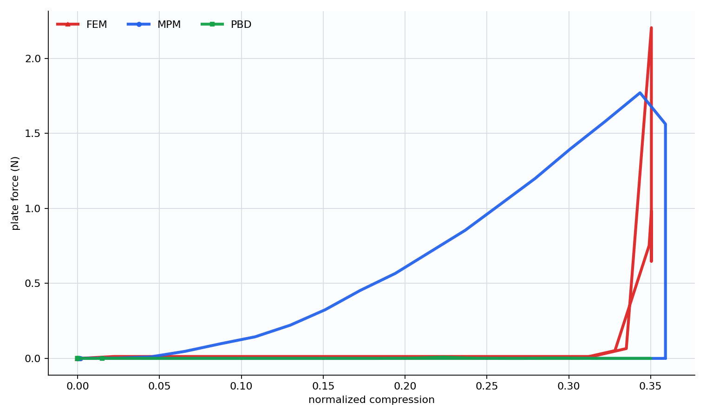
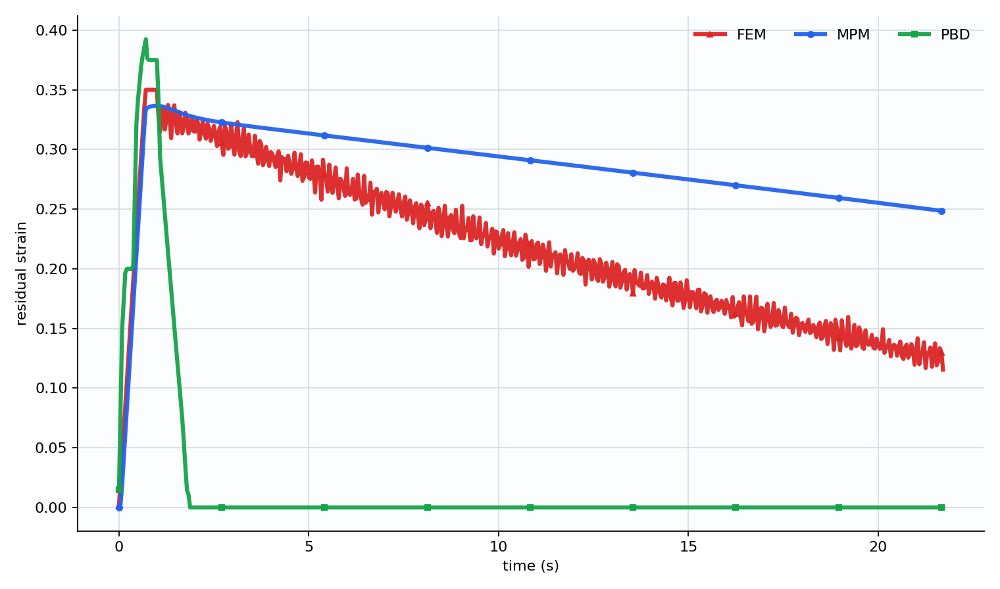
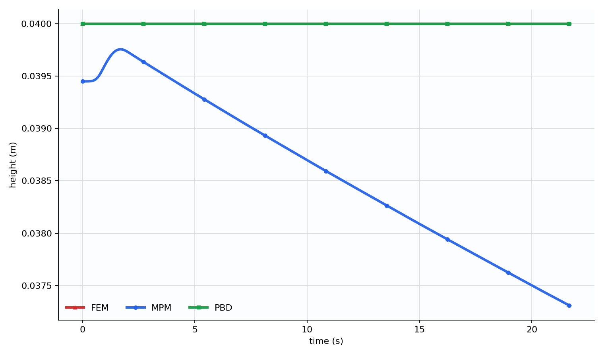
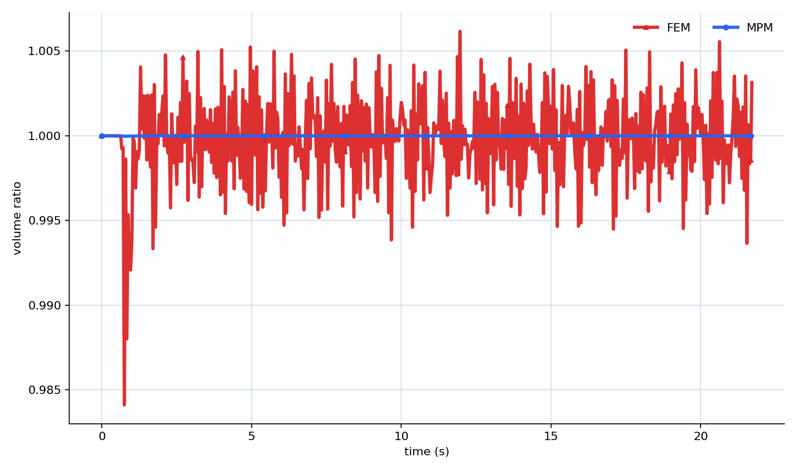

# 3D 软体夹板压缩仿真对比报告（20s 回弹窗口）

## 1. 实验目标

本报告是原 3D 球形软体夹板压缩实验的 20s 长回弹版本。实验仍然比较三种软体模拟方法：

- MPM（Material Point Method，物质点法）
- PBD（Position Based Dynamics，基于位置的动力学）
- FEM（Finite Element Method，有限元法）

和上一版报告相比，本次不改变球体尺寸、材料目标、夹板几何和压缩动作，只把释放后的观察时间从约 2s 拉长到约 20s。这样可以更清楚地观察 MPM 和 FEM 的慢回弹过程，而不是只看到释放后短时间内的残余形变。

## 2. 三种方法的原理

### 2.1 MPM：粒子和背景网格混合

MPM 用材料点携带质量、速度、形变梯度和材料状态，再通过背景网格计算动量交换、弹性应力和接触边界。每个时间步中，粒子先把信息传到网格，网格处理夹板接触和速度更新，再把结果传回粒子。

本实验中 MPM 直接使用 `E = 30000 Pa`、`nu = 0.35`、`density = 1000 kg/m^3` 等材料参数。它的优势是大变形稳定、体积保持好；不足是当前接触投影和网格耗散会让回弹偏慢。

### 2.2 PBD：位置约束投影

PBD 先预测粒子位置，再通过距离约束和碰撞约束反复修正位置。它不从应力方程直接求力，而是把软体点阵拉回满足约束的形状。

本实验中 PBD 的 `constraint_stiffness` 只是位置约束刚度，不等同于 MPM/FEM 的杨氏模量。PBD 的 `plate_force_n` 也是由位置投影修正量估计的接触力，因此数值很小，不能和 MPM/FEM 的反力直接比较。PBD 更适合比较视觉恢复和稳定性。

### 2.3 FEM：四面体有限元

FEM 把软体离散成四面体网格，在每个单元上计算形变梯度、弹性应力和节点力。本实验使用低分辨率四面体网格和显式积分。

FEM 的物理参数最可解释，反力和形变更接近传统连续介质力学框架。但它对网格分辨率、时间步和接触处理更敏感，计算成本也更高。当前 FEM 视觉点较稀疏，是为了控制计算量。

## 3. 控制变量与近似相等变量

本次 20s 实验中，三种方法尽量统一以下变量：

| 类别 | 统一设置 |
|---|---:|
| 几何体 | 直径约 40 mm 的球体 |
| 仿真域 | 0.10 m 立方域 |
| 软体中心 | `[0.05, 0.05, 0.05]` m |
| 密度 | `1000 kg/m^3` |
| 杨氏模量目标 | `30000 Pa` |
| 泊松比目标 | `0.35` |
| 夹板厚度 | `0.006 m` |
| 夹板高度/深度 | `0.075 m` |
| 初始夹板间距 | 球体直径的 `1.05` 倍 |
| 最大压缩间距 | 球体直径的 `0.70` 倍 |
| 压缩时间 | `0.70 s` |
| 保持时间 | `0.30 s` |
| 释放时间 | `0.70 s` |
| 释放后等待 | 约 `20.00 s` |
| 总帧数 | `522` 帧，`24 fps` |

近似相等但不能严格相等的变量包括：

- 离散方式：MPM 是材料点和网格，PBD 是点阵距离约束，FEM 是四面体网格。
- 刚度含义：MPM/FEM 的 `E` 进入材料应力，PBD 的约束刚度是投影参数。
- 反力定义：MPM/FEM 的反力更接近材料和接触响应，PBD 是位置投影估计力。
- 时间步和迭代：三者为稳定性使用不同 `dt`、substep 和迭代次数。
- 体积指标：MPM/FEM 有体积比估计，PBD 当前没有严格体积比。

## 4. 20s 关键图表

### 4.1 力-位移曲线

力-位移曲线主要发生在压缩和释放前期。MPM 峰值反力约 `1.77 N`，FEM 峰值反力约 `2.20 N`。PBD 的反力仍然非常小，约 `0.008 N`，原因是 PBD 力来自位置投影修正估计，不是严格材料反力。

因此，力学反力比较应主要看 MPM 与 FEM；PBD 曲线更适合作为“约束方法不擅长输出物理反力”的说明。

### 4.2 20s 回弹残余形变

20s 回弹窗口比上一版 2s 窗口更能说明差异。

PBD 在约 2s 前已经回到 `0` 附近，说明位置约束会强烈把形状拉回初始状态。它的视觉回弹最快，也最干净。

MPM 在释放后缓慢恢复。释放结束附近残余形变约 `0.3297`，到 5s 约 `0.3133`，到 10s 约 `0.2942`，最终 21.7s 时约 `0.2484`。这说明 MPM 不是完全不回弹，而是当前参数下回弹非常慢，并保留较大残余压缩。

FEM 的释放结束残余形变约 `0.3183`，到 5s 约 `0.2765`，到 10s 约 `0.2169`，最终约 `0.1154`。FEM 有明显振荡，但长期看恢复速度比 MPM 更快。

### 4.3 高度变化

高度变化反映横向压缩后软体向其他方向鼓出的程度。PBD 很快回到稳定形状；MPM 和 FEM 在长时间窗口中持续缓慢调整形状，其中 FEM 的振荡更明显。

### 4.4 体积保持

MPM 的体积比几乎保持在 `1.0` 附近，范围约为 `0.99997 - 1.00000`，体积保持最好。FEM 体积比范围约为 `0.98411 - 1.00617`，有小幅波动但仍在合理范围。PBD 当前没有体积比曲线。

## 5. 20s 数据摘要

| 方法 | 峰值反力 N | 最大穿透 m | 释放结束残余 | 5s 残余 | 10s 残余 | 21.7s 最终残余 | 体积比范围 | 平均每帧耗时 ms（去首帧） |
|---|---:|---:|---:|---:|---:|---:|---|---:|
| MPM | 1.7707 | 0 | 0.3297 | 0.3133 | 0.2942 | 0.2484 | 0.99997 - 1.00000 | 26.24 |
| PBD | 0.0084 | 0 | 0.0551 | 0.0000 | 0.0000 | 0.0000 | 未计算 | 45.86 |
| FEM | 2.2046 | 0 | 0.3183 | 0.2765 | 0.2169 | 0.1154 | 0.98411 - 1.00617 | 330.43 |

## 6. 从 20s 数据看三种方法的特点

### 6.1 MPM

MPM 的体积保持最稳定，接触穿透为 0，计算速度也不错。但 20s 曲线显示它回弹非常慢，最终仍有约 `0.2484` 的残余形变。这说明当前 MPM 设置下数值耗散和接触投影对恢复影响很大。MPM 适合展示大变形和体积保持，但要得到更自然的弹性回弹，还需要进一步调整阻尼、材料模型和接触方式。

### 6.2 PBD

PBD 的回弹最快，最终残余形变为 0。它非常适合做视觉上“能恢复原状”的软体效果，也容易保持稳定。但它的力学量最弱：反力几乎不能和 MPM/FEM 比，体积比也没有严格输出。PBD 更像动画和实时交互方法，而不是严格物理测量方法。

### 6.3 FEM

FEM 的长期恢复明显优于 MPM。2s 窗口中 FEM 和 MPM 看起来都残余较大，但 20s 窗口显示 FEM 还在持续恢复，最终残余降到约 `0.1154`。它的缺点是计算更慢，并且低分辨率显式 FEM 曲线振荡明显。FEM 适合强调材料参数、力学响应和结构弹性，但需要更好的网格和数值积分来提升视觉质量。

## 7. 结论

把释放后等待时间拉到 20s 后，三种方法的差异更加清楚：

- PBD：最快恢复，最终回到原始宽度，但力学反力不可严格比较。
- FEM：有振荡但持续恢复，长期回弹明显好于 MPM，物理解释性强但计算慢。
- MPM：体积保持最好，接触稳定，计算较快，但当前参数下回弹慢、残余形变大。

因此，如果报告主线强调视觉恢复，PBD 最直观；如果强调物理参数和长时间弹性恢复，FEM 更有说服力；如果强调大变形、体积保持和稳定接触，MPM 是最典型的代表。

20s 版本比 2s 版本更适合讨论“回弹过程”，因为它揭示了 FEM 和 MPM 的慢恢复差异，而不仅仅是释放瞬间的残余形变。

